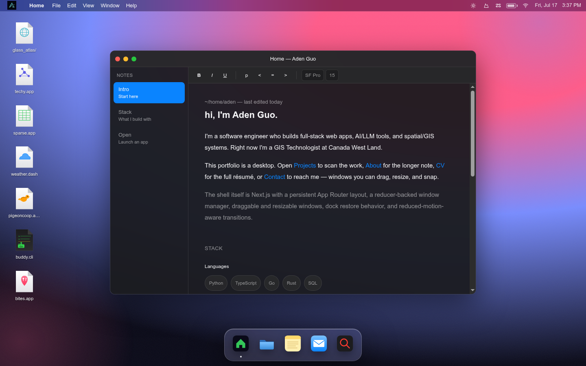

# Aden Guo — Portfolio

A macOS desktop in the browser. The portfolio boots, signs in, and drops you onto a
desktop with a menu bar, a dock, desktop shortcuts, and draggable, resizable app
windows — each window is a Next.js route (Home, Projects, About, Contact, CV, and
per-project showcases) managed by a reducer-backed window manager.



## Quick start

```bash
npm install
npm run dev     # http://localhost:3000
npm run lint    # ESLint
npm run build   # production compile
```

Phone-width visitors get a dedicated stacked mobile page instead of the desktop shell.

## How it works

- **Desktop shell** — `src/app/layout.tsx` mounts the persistent shell (wallpaper, menu
  bar, dock, shortcuts, window manager) across all route changes; routes act as app
  windows rather than page swaps. Topology and component responsibilities are in
  [`docs/ARCHITECTURE.md`](docs/ARCHITECTURE.md).
- **Window manager** — open/focus/minimize/maximize/snap state lives in a deterministic
  reducer; windows are draggable and resizable via `react-rnd`, animated with
  `framer-motion`, and reduced-motion aware.
- **Design direction** — the macOS look (glass materials, tokens, motion specs) is
  specified in [`docs/macos-redesign.md`](docs/macos-redesign.md) and
  [`docs/styling.md`](docs/styling.md).
- **Decisions** — architectural trade-offs are logged in
  [`docs/DECISIONS.md`](docs/DECISIONS.md).
- **CV pipeline** — `src/data/resume.json` (JSON Resume) renders as HTML in the CV
  window and exports an ATS-safe PDF via a print route; see [`docs/CV.md`](docs/CV.md).
- **Agent-driven workboard** — the project is built task-by-task from a machine-readable
  queue ([`docs/workboard.json`](docs/workboard.json)) with a schema and usage contract
  ([`docs/workboard.md`](docs/workboard.md)); `AGENTS.md` is the working guide for
  coding agents.

Full documentation map: [`docs/INDEX.md`](docs/INDEX.md)

## Stack

Next.js 14 (App Router) · TypeScript · Tailwind CSS · framer-motion · react-rnd · next-themes
